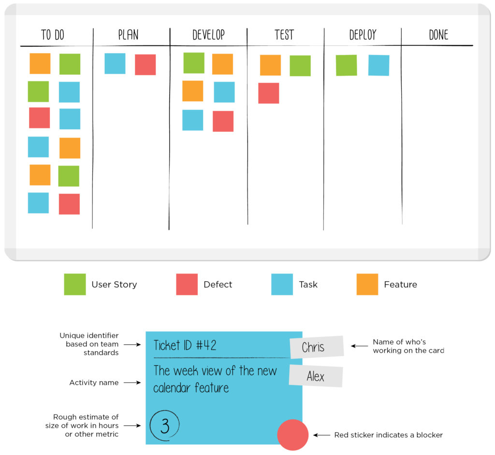
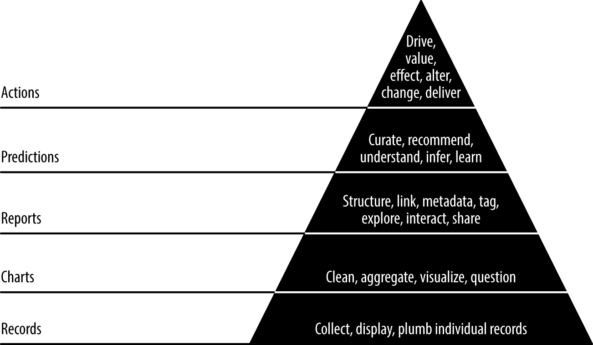
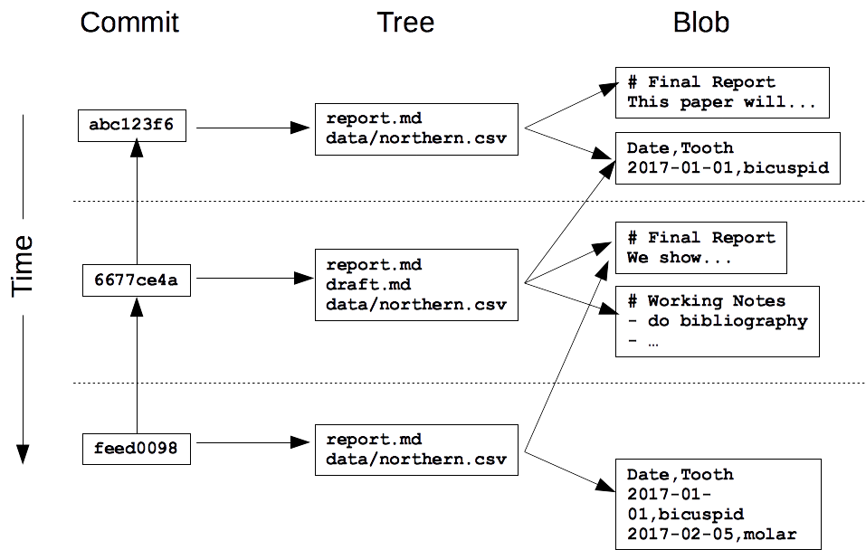

# _Agile_ Data Science

## Metodologías _Agile_

_Agile_ es un conjunto de **metodos y metodologías** diseñados para lidiar con  ciertos problemas comunes en el
desarrollo de _software_. Son relativamente sencillos de entender y de implementar.

Estas metodologías abarcan todas las áreas del desarrollo de _software_, incluyendo _project management_,
_software design_ y _process improvement_. Cada uno de estos métodos consiste de **prácticas** que están diseñadas
para su fácil adopción.

_Agile_ también es un _mindset_, enfocado en la colaboración y la comunicación. Idealmente, el equipo completo 
participa en la planeación y la toma de decisiones del proyecto, en lugar de que lo dicte un jefe o _project manager_.
Para lograr que todo el equipo adopte un _mindset_ efectivo, cada metodología ágil cuenta con un conjunto de 
**valores** que sirven como guía.

Aunque algunas prácticas ágiles pueden dar resultado por si mismas, es necesaria la adopción del _mindset_ correcto para que su eficacia sea lo mayor posible.

### ¿Por qué _Agile_?

* Es más fácil lograr cumplir los objetivos antes de la fecha límite
* Surgen muchos menos _bugs_ en el código o proyecto
* El código o proyecto se vuelve más fácil de mantener
* Los usuarios suelen estar más conformes con el desarrollo del proyecto
* Por todo lo anterior, los miembros del equipo logran un mejor balance vida/trabajo, lo que los hace aún más efectivo

### Ejemplo: _Daily Standup_

Una práctica fácil de adoptar es el _standup_ diario, en el cual los miembros del equipo hablan acerca del trabajo que 
están realizando y los retos y bloqueos que se encuentran en este proceso. Esta "junta" debe de ser corta y concisa, por 
lo que los miembros del equipo deben mantenerse de pie durante la duración de la misma.

Durante un _standup_ diario:
* Se da la comunicación entre miembros del equipo
* La colaboración sucede cuando se describe un problema que otro miembro puede ayudar a resolver
* El o los líderes del proyecto se mantienen al tanto del estatus del proyect

Aunque es una práctica sencilla, que da resultados en si misma, el _standup_ diario es particularmente efectivo cuando
todos los miembros del equipo se mantienen atentos durante toda la junta, y tienen la actitud correcta hacia ella. Si 
algunos miembros del equipo sienten que están siendo obligados a estar en una junta innecesaria, en lugar de ver el
beneficio que les trae explicar su trabajo y escuchar el de los demás, la  efectividad de esta práctica disminuye. 
Del mismo modo, si el líder del proyecto lo  toma como una oportunidad para exigir o reprender, o si se ve como un
mecanismo de reporte ante el jefe, la práctica no logra su cometido deseado.

### Valores

* **Individuos e interacciones** sobre procesos y herramientas
* **_Software_ funcional** sobre documentación comprehensiva
* **Colaboración con el cliente** sobre negociación de contrato
* **Responder al cambio** sobre seguir un plan

## Algunas Metodologías _Agile_

### Scrum

Es la metodología más comúnmente adoptada. En _Scrum_ el proyecto se divide en _sprints_, 
ciclos de igual longitud (típicamente dos semanas o 30 días) que siguen las siguientes reglas:

Al inicio del _sprint_, ocurre la planeación, donde se decidirá que _features_ se
desarrollarán durante ese _sprint_. Esto forma el _backlog_ del _sprint_. Cada día, se tiene
un _standup_ diario, llamado _scrum_. Al final del _sprint_, se muestra el avance logrado y 
se tiene una junta de retrospección, en la cual se busca qué podemos aprender de ese _sprint_.

Hay dos roles cruciales en esta metodología, el líder o dueño del proyecto, que determina
el _backlog_ del producto (del cual se alimentan el _backlog_ del _sprint_, y el 
_scrum master_, quien organiza el _standup_ diario y guía el equipo en la metodología.
Estos roles pueden ser fijos o pasar periódicamente a diferentes miembros del equipo.

### Tablero Kanban

Desarrollado en los 40s por Toyota para manufactura e ingeniería. Es una manera visual de mostrar que partes se 
necesitan y cuál es el estatus de cada una. En la actualidad se utiliza para llevar el control de tareas en 
metodologías ágiles. Consiste en un tablero (físico o digital) dividido en columnas, en las cuales se colocan
tarjetas, cada una representando una tarea, y se asignan a la columna correspondiente según su estatus. Podemos
usar colores para representar algún detalle importante de la tarea: tipo de tarea, urgencia, etc.

Cada equipo puede diseñar su tablero según considere conveniente, pero es importante mantener algunas reglas básicas:

* Las tareas se mueven de izquierda a derecha conforme se realizan
* La primera columna debe representar el _backlog_ de tareas. Aquí se agregan tareas nuevas
* La última columan representa tareas terminadas.

A menudo, un Tablero Kanban se combina con alguna otra metodología ágil para lograr tanto una planeación efectiva como
una organización visual del avance del proyecto.

### Otras

**XP**: eXtreme Programming, es una metodología basada en aceptar el cambio y desarrollar 
features sólo cuando sea necesario, no cuando se cree que lo será. El trabajo se organiza en 
*quarters*, con subciclos semanales. En la planeación se agrega cierta **holgura** con 
features o tareas opcionales que pueden abandonarse si el equipo se atrasa.

**FDD**: Feature-Driven Development, se enfoca en convertir **modelos** en _software_ 
siguiendo iteraciones quincenales. Cada modelo consiste en una lista de features a implementar
 A diferencia de otras metodologías, hay una serie de pasos estrictos para producir
  _software_ viable consistentemente. Especificación de dominio, diseño, 
  desarrollo e inspección

**Crystal**: Una metodología más ligera, organiza el trabajo según qué tan crítico es cada
_feature_ o tarea. Típicamente hay 4 niveles: _Comfort_, _Discretionary Money_, _Money_ y _Life_.

 
## _Agile_ en la Ciencia de Datos

En la Ciencia de Datos, como en el desarrollo de _software_, equipos colaboran para entregar valor a través de
procesos complejos: diseño, análisis, programación, etc. Las metodologías ágiles proveen una manera de organizar
este trabajo y asegurar que entreguemos valor de una manera consistente y temprana.

Algunos aspectos de la metodología ágil aplican especialmente a la Ciencia de Datos:

### La importancia de iterar

Dificilmente se logra tener un análisis certero o un producto de Ciencia de Datos terminado "a la primera". A menudo
se requiere iterar. Si logramos entregar valor en cada ciclo de desarrollo, naturalmente iteramos de una manera
eficiente

### Entregar resultados intermedios

Como en el desarrollo de _software_, un problema frecuente en la Ciencia de Datos es que el análisis realizado o
los modelos predictivos construidos pueden no ser lo que se esperaba por el cliente. Mientras más tiempo pase entre
la especificación y la entrega, es más probable que surjan malentendidos y sea difícil ajustar requerimientos. Planear
entregables "pequeños" nos ayuda a validar la ruta que estamos tomando, y adaptarnos al cambio en los requerimientos
o a la llegada de nueva información

*****

Así como hay aspectos donde la aplicación de metodologías ágiles no difiere entre la ciencia de datos y el desarrollo
de _software_, hay consideraciones especiales que se deben hacer en un proyecto de ciencia de datos al usar estas
metodologías, que dificilmente surgen en un proyecto de _software_

### ¿Experimentos o tareas?

A diferencia de la ingeniería o el desarrollo de _software_, la **ciencia** de datos se basa en experimentos. Un
resultado negativo es un resultado valioso y debe ser tomado como tal. Es importante que al organizar el trabajo y 
definir metas para un ciclo de desarrollo se tenga claro qué consiste en un experimento y qué en una tarea. Intentar
encontrar un modelo predictivo para algún fenómeno de interés dados ciertos datos puede verse como un experimento,
mientras que preparar este modelo para su uso en un sistema es más claramente una tarea.

### Escucha a los datos

Al planear, organizar trabajo y decidir un _backlog_, es importante tomar en cuenta lo que nos dicen los datos. 
¿Hay algún _insight_ nuevo que nos indique la necesidad de cambiar la dirección del proyecto? Es bueno intentar 
analizar esto a partir de visualizaciones y análisis exploratorio. 

### Usa la "pirámide de valor de datos"

Esta pirámide expresa el valor creciente que se obtiene de analizar datos. Empezamos por convertirlos en tablas y
gráficas, pasamos a reportes, predicciones, y finalmente, acciones habilitadas por todo lo anterior. Mientras más
robustos sean los niveles inferiores, más seguros estarán los superiores. 

Esta pirámide da estructura a nuestro trabajo, indicando posibles resultados intermedios. La pirámide es una guía, no
una regla a seguir. A veces podemos saltarnos pasos o trabajar "hacia abajo".

### Habla del proceso

Una buena regla a seguir para lograr entregas intermedias es, que si aún no logramos tener un entregable concreto o
algunos _insights_ que nos ayuden a vender nuestro trabajo, podemos hablar del proceso que estamos siguiendo y
entregar eso: ¿Qué dificultades existen para realizar el análisis? ¿Por qué creemos que nuestras predicciones no 
resultaron buenas? ¿Qué datos nos gustaría tener?

Respuestas a estas preguntas son buenos entregables de un experimento, pues nos permiten guíar el proceso científico
y escalar la pirámide.

## Herramienta: Control de versiones (git)

Una de las herramientas más útiles para colaborar en un proyecto de Ciencia de Datos es una herramienta de control
de versiones. Este tipo de herramientas nos permiten mantener la historia de todos los cambios que se han hecho
al proyecto, marcando cada uno de ellos de manera incremental. En particular, utilizaremos git, el estándar en
la industria para control de versiones desde hace varios años.

Algunas características:
* Nada que se registre en git se pierde jamás. Siempre podemos regresar a una versión anterior de nuestro proyecto
* git nos notifica cuando nuestro trabajo entra en conflicto con el de alguien más, pues cambiamos el mismo archivo 
de una manera incompatible. Esto hace más difícil sobreescribir el trabajo de alguien más.
* Con un servidor de git, podemos sincronizar el trabajo hecho por varias personas en sus máquinas.

### Conceptos básicos y vocabulario

* **Repositorio**: Es donde se encuentra nuestro trabajo. Dependiendo del tamaño y complejidad del proyecto podemos
tener uno o varios repositorios de git
* **_Commit_**: Es la acción de registrar un cambio incremental a git. Va acompañado de un mensaje corto, describiendo
en breves palabras este cambio. Es la unidad básica de la historia de git.
* **_HEAD_**: El _commit_ en el que se encuentra la versión local de nuestro repositorio. Moverse en la historia 
equivale a cambiar el _HEAD_
* **_Checkout_**: Quiere decir mover el proyecto actual a un _HEAD_ en particular.
* **_Branch_**: Las ramas de git nos permiten trabajar en paralelo sobre el mismo proyecto, sin temor de sobreescribir
cambios de alguien más. También son útiles para separar unidades de trabajo. Podemos hacer _checkout_ a una rama.
* **_Clone_**: El acto de copiar un repositorio (típicamente remoto) a una ubicación específica (típicamente local)

Estos elementos básicos nos permitirán introducir conceptos más complejos conforme avancemos.

### La historia completa

git guarda cada _commit_ de cada _branch_ en la carpeta `.git`. Esta carpeta se localiza en la carpeta raíz de nuestro
repositorio. Sin esta carpeta especial, nuestro repositorio no tiene ninguna de las capacidades de git, y es una
simple carpeta.

### Staging

Para realizar un _commit_, es necesario agregar archivos que hayan cambiado al _stage_, una vez añadidos, podemos
realizar un _commit_ y agregar un breve mensaje explicando estos cambios.

### Comandos básicos
* `git clone`: Replica un repositorio remoto en nuestra máquina local
* `git diff`: Muestra diferencias que no estén en _staging
* `git add`: Agrega archivos al _stage_.
* `git status`: Muestra posibles cambios a agregar al _stage_
* `git commit -m`: Hace _commit_  de los cambios en el _strage_
* `git stash`: Toma los cambios no agregados al _stage_ y los pone en el _stash_

### Ejercicio: `git diff` y `git add`

### `git config`

Antes de poder hacer commits, debemos indicarle a git ciertas configuraciones. Ya que git lleva el control de qué
usuarios hicieron qué _commits_, es necesario configurar nuestra identidad en git

Además, las opciones de `git config` nos permiten comportar cierto comportamiento básico, como que editor se usa por
defecto para editar mensajes de _commit_

### Ejercicio: `git config`

### Ejercicio: `git commit` y `git log`

### ¿Cómo guarda Git la información?

### ¿Cómo funcionan los _commits_?

Cada _commit_ a un repositorio es identificado a través de un **hash**, (resultado de una función _hash_) que 
reduce bloques de texto a una cadena de caracteres, por ejemplo `7c35a3ce607a14953f070f0f83b5d74c2296ef93`. Esto permite
no sólo identificar únicamente una versión específica de los archivos especificados, sino que asegura que no se pueden
introducir cambios malicios fácilmente.

* `git show <commit hash>` muestra los cambios que realizó el _commit_ correspondiente

### `git blame` y `git annotate`

Muestran los commits que modificaron cada línea en un archivo, con la referencia _hash_ del último _commit_ que la 
modificó y el usuario responsable de ese _commit_.

La única diferencia entre estos dos commandos es como muestran la salida.

### `.gitignore`

En este archivo especial podemos especificar reglas para que git ignore los archivos que se especifican en él. Podemos
incluir reglas genéricas para algunos tipos de archivos, poe ejemplo `*.csv`

### Ejercicio: `.gitignore`

### Branches

Hasta ahora hemos trabajado en una sola rama, `master`, uno de los _features_ más poderosos de git. 

## git para Ciencia de Datos

## Segunda herramienta: Kanban

## Kanban para Ciencia de Datos

## Combinando git y Kanban

## Lecturas recomendadas

* [Head-First Agile](http://shop.oreilly.com/product/0636920022374.do)
* [What is a Kanban Board?](https://leankit.com/learn/kanban/kanban-board/)
* [A manifesto for Agile Data Science](https://www.oreilly.com/ideas/a-manifesto-for-agile-data-science)
* [Agile Data Science 2.0](http://shop.oreilly.com/product/0636920051619.do)
* [A successful git branching model](https://nvie.com/posts/a-successful-git-branching-model/)
